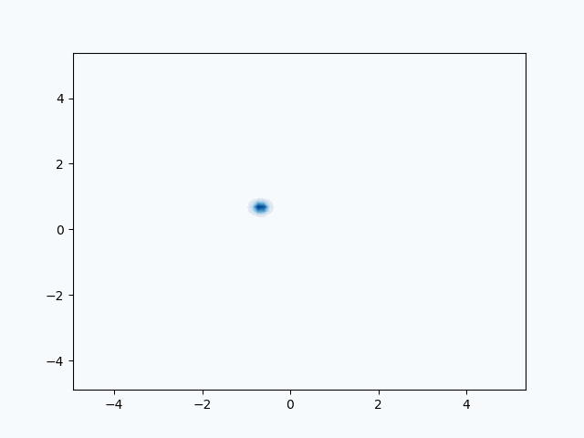

# Mean-field variational inference via polyhedral optimization

This repository provides a full implementation of our method for solving mean-field variational inference based on optimal transport: for $\pi \propto e^{-V}$, we want to solve
$$\pi^\star = \text{argmin}_{\mu \in \mathcal{P}(\mathbb{R})^{\otimes d}} \ \text{KL}(\mu\|\pi)$$
where $\mathcal{P}(\mathbb{R})^{\otimes d}$ is the space of $d$-dimensional product measures. Our approach is based on what we call *polyhedral sets* in the Wasserstein space. The GIF below is an visualization of our approach for computing the mean-field approximation to a product Gaussian mixture using only access to $V$ and $\nabla V$. 

<p align="center">

</p>

## Examples
Jupyter notebooks that replicate the experiments found in our paper can be found in [`examples`](./examples), where we compute the mean-field approximation to: a product Gaussian mixture example (which is itself), a non-isotropic Gaussian, and a posterior arises from a synthetic Bayesian logistic regression problem.

## Basic usage
At the core is one method `MFVI_obj` which performs all the computation. The user is required to pass in the appropriate truncation parameter, mesh-size, and $V$ and $\nabla V$, as well as some hyper-parameters for the optimization (e.g., step-size, number of iterations, number of stochastic samples).

## References

If you found this code helpful, or are building upon this work, please cite 

Yiheng Jiang, Sinho Chewi, and Aram-Alexandre Pooladian. "Algorithms for mean-field variational inference via polyhedral optimization in the Wasserstein space." *arXiv.* 2023. [[arxiv]](https://arxiv.org/abs/2312.02849)

```
@article{jiang2023algorithms,
  title={Algorithms for mean-field variational inference via polyhedral optimization in the Wasserstein space},
  author={Jiang, Yiheng and Chewi, Sinho and Pooladian, Aram-Alexandre},
  journal={arXiv preprint arXiv:2312.02849},
  year={2023}
}
```
